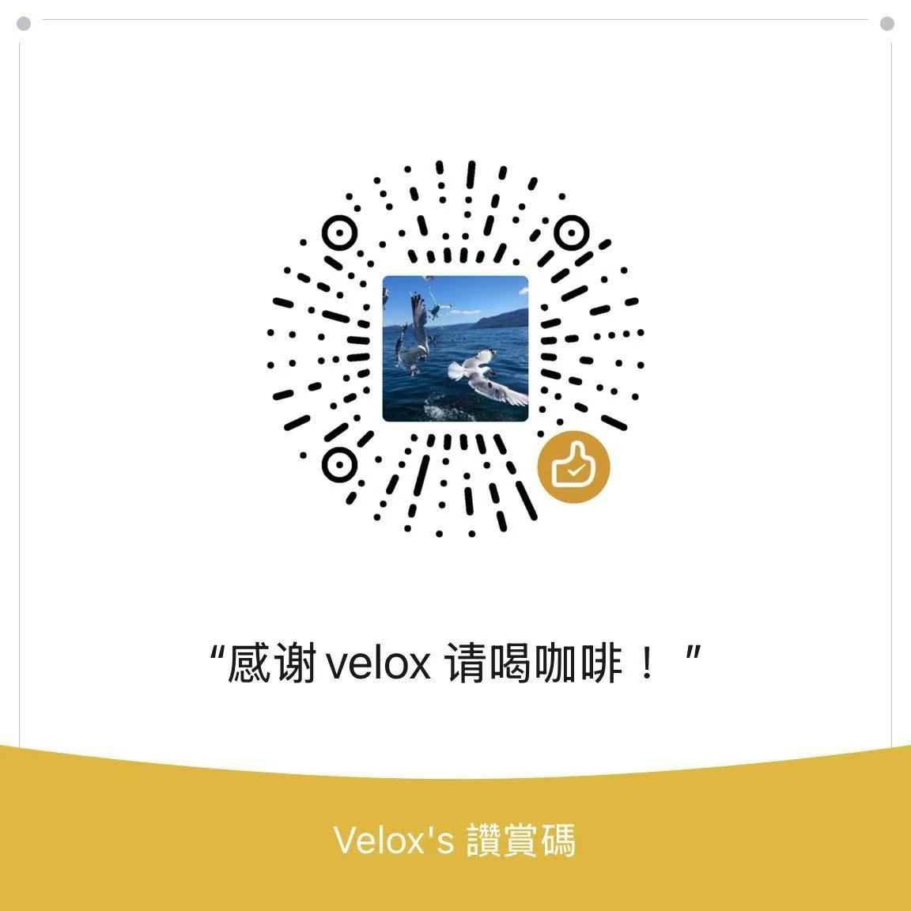

# ⚡ Velo.x AI - 零成本地表最强 AI 助理指南


> **声明**：这是一个利用 **Cloudflare Workers** + **Groq** + **Telegram** 实现的全能型 AI 助手。支持 **Llama 3.3 极速对话**、**长期记忆存储** 以及 **SDXL 电影级写实绘图**。

---

## 🌟 核心特性

- 💰 **完全免费**：白嫖 Cloudflare 和 Groq 的顶级算力。
- 🧠 **长期记忆**：基于 Cloudflare KV 数据库，支持上下文连贯对话。
- 🎨 **艺术创作**：内置写实增强算法，一键生成 8K 质感大片。
- 🔒 **私有部署**：支持 `ADMIN_ID` 鉴权，只听命于你一个人。
- 🛠️ **灾难恢复**：内置 Plan B，Groq 挂了可一键无缝切换至 CF 原生模型。

---

## 🛠️ 快速开始

### 1. 准备工作
- **Cloudflare**: 注册并登录 [Cloudflare Dash](https://dash.cloudflare.com/)。
- **Telegram**: 找 [@BotFather](https://t.me/botfather) 获取 `Bot_Token`。
- **Groq**: 在 [Groq Console](https://console.groq.com/) 申请免费 API Key。

### 2. 环境配置
在 Cloudflare Worker 的 **Settings** 中配置：
- **KV 绑定**: 创建 `AI_MEMORY` 空间，变量名设为 `MEMORY`。
- **AI 绑定**: 添加 Workers AI，变量名设为 `AI`。
- **环境变量**:
  - `TG_BOT_TOKEN`: 你的机器人 Token
  - `GROQ_API_KEY`: 你的 Groq 密钥
  - `ADMIN_ID`: 你的 TG 数字 ID

### 3. 部署代码
将仓库中的 `index.js` 代码复制到 Worker 编辑器并部署。

---


---

## 🚨 容灾方案 (Plan B)

如果 Groq API 故障，请将 `fetchGroqWithHistory` 替换为以下代码以调用 Cloudflare 原生模型：

```javascript
async function fetchGroqWithHistory(messages, env) {
    const response = await env.AI.run('@cf/meta/llama-3-8b-instruct', {
        messages: messages,
        stream: false
    });
    return response.response || "❌ CF AI 无响应";
}
```

## ☕ 作者与支持

如果觉得这个项目对你有帮助，欢迎给我一个 **Star** ⭐️！

如果你想支持我的持续开发，可以通过微信扫码请我喝杯咖啡，这是我最大的动力！

<div align="center">
  
  <br>
  <p><b>感谢 Velox 大佬！</b></p>
</div>
